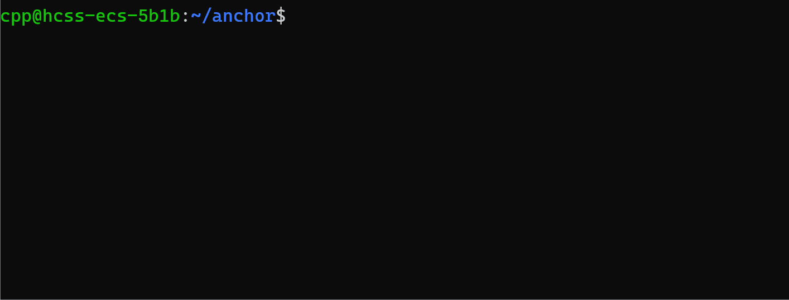
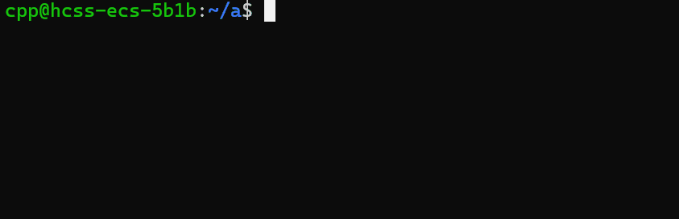

# anchor

> 你是linux命令行玩家，你想贯彻你的态度，不想使用类似图形化文件目录，又或者你的条件不持支使用图形化的文件系统

> 但是，想象一下，当你进行项目调试时，由于项目结构的限制，需要频繁切换目录，而常用的目录就那几个，如果是相邻目录还好，可是复杂的项目结构让你疲于切换目录，不仅手指难受，还大大降低了你的生产力(尽管程序员的生产力并不是靠速度衡量的，但是你的时间和手指健康仍然宝贵)

## 安装 & 配置全局快捷键

```
下载anchor.sh,并编辑其中的 'STORAGE_DIR'与'STORAGE_FILE'
加载anchor.sh
```

## 全局与局部anchor

```
anchor意思是锚点，你可以理解为快捷路径，例如普通用户~代表/home/usr
```

```
你需要一个全局文件,不管叫什么，例如/home/a/b/c/.anchor

你需要在anchor.sh中把'STORAGE_DIR'设置为绝对目录/home/a/b/c
'STORAGE_FILE'设置为.anchor
```

##### 编辑全局anchor
在上述的文件中，以anchor=path的格式编写多行anchor，like：
```
home=~
c=../
b=/home/a/b
a=~/a
```
- ../等相对路径基于'STORAGE_DIR'
- 重复anchor会覆盖
- anchor会解析软链接

## 使用
```
# 建议写入登陆脚本，通常是.profile或.bashrc文件

source anchor.sh
load
```

```
# 帮助
help
```

```
# 添加anchor
# add anchor path ，这里的path基于你运行add的目录，-l为local anchor 本次登陆结束后anchor消失，-g为global anchor 会写入上述存储文件，每次load的时候加载

add home ~ -l
add a ~/a -g
```

```
# 查看anchor
list
```

```
# 删除anchor
clr home
clr a
```

```
# 切换anchor指向的目录
to home
```

加载与配置全局anchor



添加，删除，切换anchor



