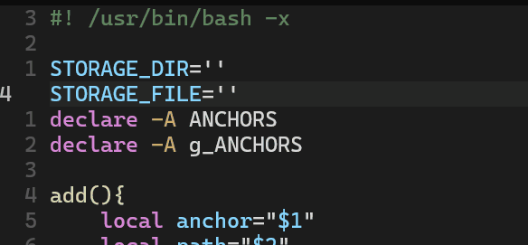
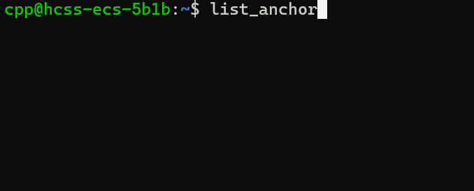
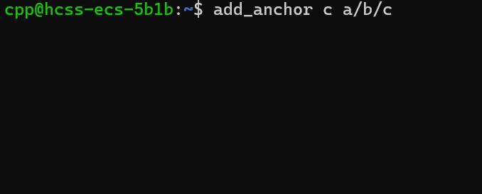
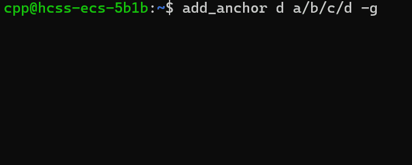
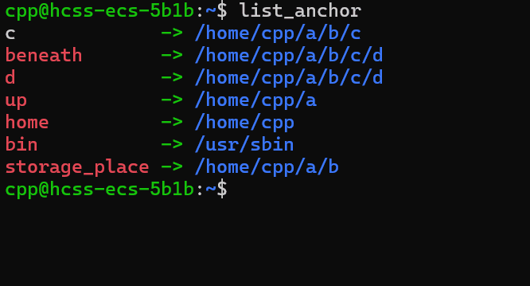
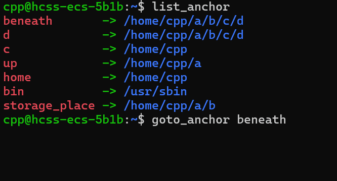

# anchor

> 你是linux命令行玩家，你想贯彻你的态度，不想使用类似图形化文件目录，仅靠命令来切换目录。    

> 但是，想象一下，当你进行项目调试时，由于项目结构的限制，需要频繁切换目录，而常用的目录就那几个，如果是相邻目录还好，可是复杂的项目结构让你疲于切换目录，不仅手指难受，还大大降低了你的生产力(尽管程序员的生产力并不是靠速度衡量的，但是你的时间和手指健康仍然宝贵)

## 安装 & 配置全局快捷键

```
下载anchor.sh,并编辑其中的 'STORAGE_DIR'与'STORAGE_FILE'，
```

#### 设置全局文件路径
假设你的目录结构如下
```
home
   |
   cpp
     |
     └── a
         └── b (STORAGE_DIR)
             |
             ├── c
             │   └── d
             |
             └── s.txt(STORAGE_FILE)
```


- 'STORAGE_DIR'应该是 绝对目录


#### STORAGE_FILE 写入全局快捷键与路径

- 'STORAGE_FILE'中不要出现空行，或者非anchor=path的结构
- 除了~对应家目录，其他的相对目录都是基于STORAGE_DIR的  
- 重复快捷键下面的会覆盖上面的
- 会把链接解析为链接所指向的路径
```
bin=/bin
bin=/sbin
home=~
storage_place=.
up=../
beneath=c/d
```
上述实际路径,这二者等效，不过我更喜欢上一种
```
# 链接被替换，重复会覆盖
bin=/usr/sbin
home=/home/cpp
storage_place=/home/usr1/a/b
up=/home/usr1/a
beneath=/home/usr1/a/b/c/d
```

# 使用

加载脚本
```
# 粘贴下列命令，并执行
# 当然，如果你不想每次登陆就运行这两个命令，你可以把它们写入你的登陆shell中，通常是.profile 或 .bashrc文件

source anchor.sh
load_anchor

```

查看anchor
```
# 如果你的终端不支持颜色，你需要修改anchor.sh中的list_anchor函数中的第208行和第214行，将其中的 ${GREEN} ${NC} ${RED} ${BLUE} 删除即可

# 如果您的终端支持颜色输出的话，使用list_anchor 后 您将看到类似下列图形
# 箭头左侧代表快捷键,箭头右侧代表实际目录，红色的快捷键代表全局快捷键，即STORAGE_FILE中存储的快捷键

list_anchor
```



添加快捷键与路径
```
# 除了向STORAGE_FILE中添加全局存储的快捷键，我们如果仅在本次登陆需要设置快捷键和路径怎么办

# anchor代表快捷键名称
# path则是快捷键对应路径，如果没有,则为执行add_anchor的目录下,如果是相对路径，则相对于执行add_anchor的目录，与上面的全局快捷键的相对路径不同
# -g 表示作为全局快捷键添加，会将anchor和path写入STORAGE_FILE,如果没有-g，表示仅对当前登陆生效，下一次登陆作废

add_anchor anchor
add_anchor anchor -g
add_anchor anchor path
add_anchor anchor path -g
```

添加本地快捷路径  
c在本次用户登出后作废


添加全局快捷路径  



覆盖路径或者属性



```
# 切换到anchor对应目录

goto_anchor
```




# 帮助

```
    anchor_help
```

# 别名
```
# 当然如果你感觉 list_anchor,add_anchor名字太长了，你可以在你的.profile 或者.bashrc中使用别名,不过你要确保别名没有重复
# like

alias goto='goto_anchor'
alias add='add_anchor'
alias list='list_anchor'
```

enjoy it
